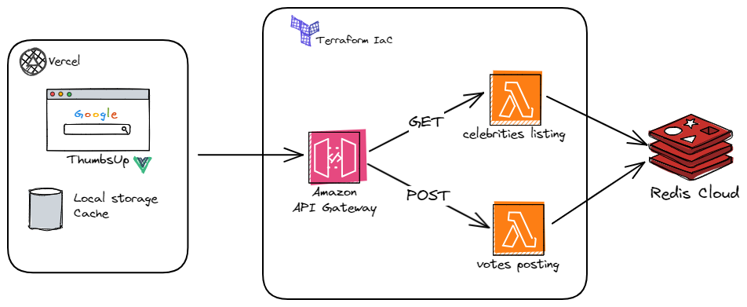

# Welcome to Thumbsup™️ Backend - Zemoga FED 👍

With the objective of challenging myself and delivering a simple but well-structured ecosystem, I built the following microservices architecture using some famous and recommended applications used in the market.
All the Infrastructure orchestration is given by Terraform, AWS Resources (NodeJS ephemeral lambdas, API Gateway v2) handles the basic HTTP routing and logic implementation, Redis as a Low latency persistency system is my choosen one for the persistency component.

# Technologies used
- Node JS
- Javascript
- Redis (Redis Cloud)
- AWS Lambdas
- AWS API Gateway v2
- Terraform (AWS Provider)

## Utilities
- ioredis: Very useful redis client for Node JS.

# Getting started (Local development)

1) Clone the [repository](https://github.com/duquejo/ThumbsUp_backend).
2) In each lambda install required dependencies using:
```sh
npm install
```

3) Copy `.env.sample` file and rename it as `.env` for local development, later, fill this parameters:
```sh
REDIS_HOST=
REDIS_PORT=
REDIS_USERNAME=
REDIS_PASSWORD=
```
You could use Redis Cloud (Free tier) to achieve that or use a dockerized one to simulate a real instance.

4. If you want to execute the lambdas locally, you can use this command, but is very important to install globally this utility:
```sh
npm install -g lambda-local
npm run dev
```
You can use this tool as an API or a command line tool. I already use it for testing local lambdas.

5. Test the local endpoints using your favorite tool and consuming this endpoint `http://localhost:8008`.
6. **NOTE**: The AWS API Gateway has actually a integration that transforms and parses the content messages, so, try to send the testing data as a string like this (_Stringified JSON_):

```txt
"{\"celebrities\":{}}"
```

# General architecture overview
As I shown in the frontend repository documentation, this is the general architecture overview:


## Repository rules
If you want to contribute, you must follow the [GitFlow](https://nvie.com/posts/a-successful-git-branching-model/) basic rules.

# Future Challenges and beloved ideas 🌨️
- Add more components in order to guarantee votes update.
- Implement an SQS Strategy using AWS or another service like RabbitMQ or Kafka.
  - Enqueue not sent votes though DLQ strategy with the objetive to improve resiliency.
- Add general observability and trace, using Datadog, Dynatrace...
- Change JS logic to Typescript and improve lambda bundle code optimization.
- Add prettier and Lint.
- Add SonarQube and create Quality gates.
- Add unit tests, integration tests.

+ For obviously reasons 😅 this backend is not going to be alive forever 💸, so, in a few months I'm going to destroy all resources _(Thank you terraform for made it easy)_.

_Thank you so much_ 🎶